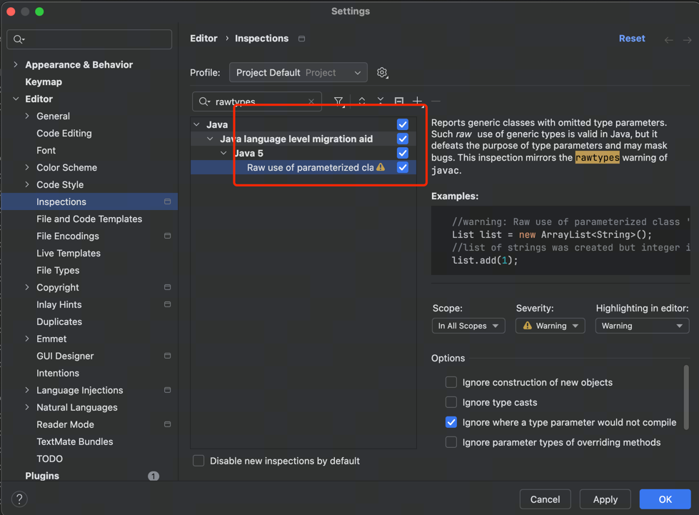

## emos-wx-api
```text
语雀地址
https://www.yuque.com/yuyayong/xt4xee/swor48wrsdlu2m2b
```

## 腾讯位置服务
```text
https://lbs.qq.com/dev/console/home

https://lbs.qq.com/miniProgram/jsSdk/jsSdkGuide/jsSdkOverview
```

## 错误警告
```text
全局抑制特定警告：在 IntelliJ IDEA 的设置中，你可以配置来抑制特定类型的警告。通过访问 File -> Settings -> Editor -> Inspections，然后搜索 "rawtypes"，
你可以找到相关的警告设置并禁用它。这种方法会影响整个项目的所有警告
```
